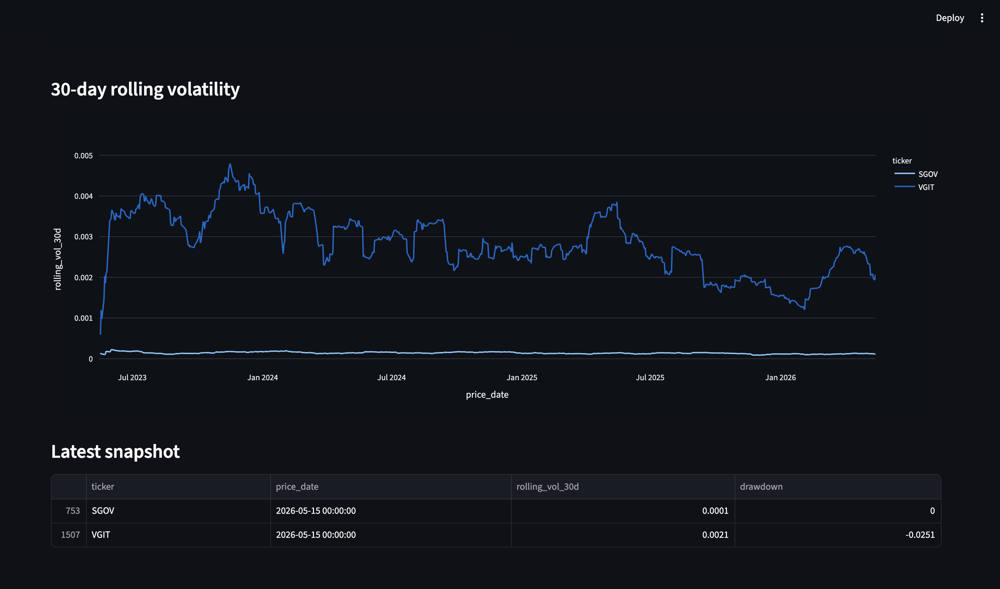

# ETF Analytics Pipeline

Automated daily ingestion and analytics for **SGOV** (short-term U.S. Treasury ETF) and **VGIT** (intermediate-term U.S. Treasury ETF). Replaces manual spreadsheet downloads with a reproducible raw → staging → mart pipeline and a Streamlit dashboard.

## Business requirement

> Research and portfolio teams need a consistent daily view of SGOV vs VGIT performance and risk (returns, volatility, drawdown) without copying prices into Excel.

## Scope

| Item | Choice |
|------|--------|
| Tickers | `SGOV`, `VGIT` |
| Frequency | Daily (trading days) |
| Source | Yahoo Finance via `yfinance` (portfolio / educational use; not for production trading) |
| Storage | Local `data/raw/` (S3-compatible layout documented in [architecture](docs/architecture.md)) |
| Warehouse | PostgreSQL (local via Docker) |
| Transform | dbt (`staging` → `marts`) |
| Orchestration | Apache Airflow |
| UI | Streamlit |

## Repository layout

```text
etf-analytics/
├── README.md
├── docs/
│   ├── architecture.md
│   └── data-dictionary.md
├── docker-compose.yml
├── ingest/                 # Extract & load raw
├── data/raw/               # Local raw landing zone
├── dbt/                    # Staging & mart models
├── airflow/dags/           # Pipeline DAG (wire after tasks work standalone)
├── dashboard/              # Streamlit app
└── tests/                  # Python unit tests for transform logic
```

## Prerequisites

- Docker & Docker Compose
- Python **3.10–3.12** for dbt (3.14 is not supported by dbt yet)
- [dbt-core](https://docs.getdbt.com/) + `dbt-postgres` (after Postgres is up)
- If port **5432** is already used locally, this project maps Postgres to **5433** (see `.env.example`)

## Quick start

### 1. Start infrastructure

```bash
cp .env.example .env
docker compose up -d
```

Wait until Airflow UI is available at http://localhost:8080 (default credentials in `.env.example`).

### 2. Install ingest dependencies

```bash
cd ingest
python -m venv .venv && source .venv/bin/activate
pip install -r requirements.txt
```

### 3. Run ingest (verify raw files)

```bash
python fetch_sgov_vgit.py
ls -la ../data/raw/
```

### 4. Run dbt

```bash
cd ../dbt
cp profiles.yml.example profiles.yml   # edit if needed
dbt debug && dbt run && dbt test
```

### 5. Run unit tests (transform logic)

```bash
cd ..
pip install pytest pandas numpy
pytest tests/ -v
```

### 6. Enable Airflow DAG

After ingest and dbt succeed manually, unpause `etf_pipeline` in the Airflow UI.

### 7. Streamlit dashboard

```bash
cd dashboard
pip install -r requirements.txt
streamlit run app.py
```

Open http://localhost:8501 — compare **SGOV** (short Treasury) vs **VGIT** (intermediate Treasury).

## Dashboard

| View | Metrics |
|------|---------|
| **Adjusted close** | Price level over ~3 years |
| **Cumulative return** | Compounded daily returns |
| **30-day rolling volatility** | Risk comparison |
| **Latest snapshot** | Most recent vol & drawdown per ticker |




## Development order (recommended)

1. Document (`README`, `architecture`, `data-dictionary`) — done at init
2. Ingest script → confirm `data/raw/` files
3. dbt staging models → `dbt test`
4. dbt mart models
5. Airflow DAG (glue only; each task already works alone)
6. Streamlit dashboard

## Limitations

- Free market data may be delayed or revised; document as-of dates in mart tables.
- Not investment advice; for portfolio demonstration only.

## License

MIT (add your name in a follow-up commit if needed).
