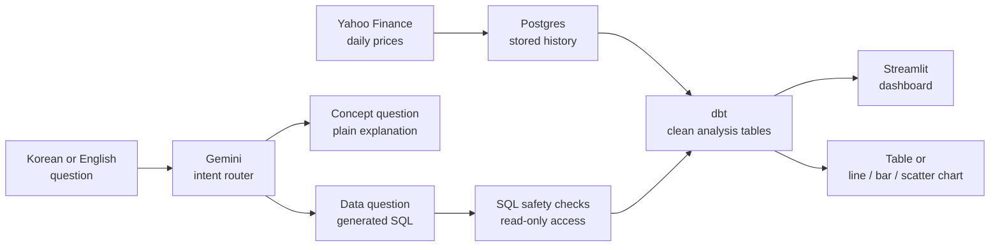

# ETF Analytics Pipeline

[](https://github.com/aestim/etf-analytics/actions/workflows/test.yml)

🔗 **Live app:** [etf-analytics-pipeline.streamlit.app](https://etf-analytics-pipeline.streamlit.app/) — refreshed after US trading days; the dashboard has a parquet fallback, while Ask uses the configured Postgres warehouse and Gemini API for historical data questions

Automated daily ingestion and analytics for a configurable **cross-asset ETF universe** (17 tickers by default: US large/small-cap, dividend, international developed & emerging equity, leveraged equity, Treasuries, credit, TIPS, gold, REITs). Reproducible raw → staging → mart pipeline, a multipage Streamlit app with a pytest-covered **Strategy Lab**, and a safety-gated **LLM-powered natural-language Q&A layer**. Formal golden-set evaluation is the remaining Q&A roadmap item.

## Start here if you are not technical

An **ETF** is a basket of investments that trades under a short code called a
**ticker**. For example, `SPY` follows large US companies, `BND` represents a
broad US bond basket, and `GLD` tracks gold.

This project does four simple things:

1. Downloads each ETF's daily market history.
2. Cleans it and calculates return, price swings and the worst fall from a peak.
3. Shows the results as charts and tables.
4. Lets a person ask a Korean or English concept or data question, such as
   `양의 상관관계가 뭐야?` or `지난 1년 수익률이 가장 높은 ETF 3개는?`

It is an educational comparison tool, **not** a prediction service or a request
to buy or sell an investment. The first dashboard view starts with three
representative funds (`SPY`, `BND`, `GLD`) so a new reader is not confronted by
17 overlapping lines at once.

The interface opens in **English** for international portfolio review. A shared
`English | 한국어` control in the sidebar switches all three pages for the current
session, while the Ask answer itself follows the language of the question.

## How the pieces connect



The AI cannot write to the database and never runs generated Python code. It
only proposes one read-only SQL query; ordinary code checks that query before
execution.

## Business requirement

> Research and portfolio teams need a consistent daily view of ETF performance and risk (returns, volatility, drawdown) across asset classes without copying prices into Excel — and want to ask questions about the data in plain language.

## Features

- **Ingest** — yfinance daily prices (one batched request for the env-driven `ETF_TICKERS` universe), parquet landing zone + idempotent Postgres upsert; cloud runs use a 1-month overlap on weekdays and a 10-year monthly reconciliation
- **Transform** — dbt `staging → marts` (daily returns, 30-day rolling volatility, drawdown) plus a `dim_etf` reference dimension (asset class, sub class, leverage, plain-language description) built from a seed
- **Data quality** — 17 dbt tests including an anomaly tripwire that warns if any daily return exceeds ±75%
- **Orchestration** — Airflow DAG (`ingest → dbt run → dbt test`) and a GitHub Actions daily ingest that refreshes the cloud warehouse without writing to `main`
- **Dashboard** — Streamlit multipage: English-first interface with a session-wide Korean switch, readable 17px base typography, stable 24-color palette, interactive ticker guide, mobile-safe charts, and translated metric tooltips
- **Session ETF lookup** — visitors can search by ETF name, ISIN, or Yahoo Finance symbol, browse up to eight mobile-friendly listing cards, filter Yahoo's ETF/other classifications, and explicitly select one of up to five session symbols for Overview and Strategy Lab; exact ticker and name-term matches rank first, share-class words such as `Acc` are safely relaxed on an empty search, and an exact-symbol fallback remains available
- **Strategy Lab** — a beginner-friendly custom ETF portfolio simulator with independently selectable entry timing and annual rebalancing, an optional second custom strategy, an always-visible comparison with five examples, and a separate detailed example view; adjusted prices include ETF operating expenses and distributions, while pure pytest-covered functions keep calculations separate from the UI
- **Ask** — Gemini routes English/Korean questions to a plain concept explanation, a safe historical-data query, or a refusal; answer tables and deterministic chart titles/axes follow the question language, and conclusion-first correlation summaries require no second LLM call
- **Security** — dedicated read-only role (`etf_reader`, SELECT on marts only) for the Q&A layer
- **Demo mode** — with no database reachable, dashboard pages use a bundled parquet fallback snapshot and recompute the marts in pandas; Ask can still explain concepts when Gemini is configured, while historical data questions wait for Postgres

## LLM Q&A layer

Plain-language questions ("Which long-duration Treasury ETF had the lowest volatility this year?") answered against the marts:

1. **Intent routing + Text-to-SQL** ✅ — one Gemini structured-output call returns `concept_question` with a beginner-friendly explanation, `data_query` with SQL, or a precise `out_of_scope` refusal. The schema prompt is generated from dbt docs (`schema.yml` + `dim_etf`); explicit historical windows up to 10 years override the 1-year default, and cross-ETF relationships work without naming a ticker — see [`qa/ask.py`](qa/ask.py)
2. **Safety** ✅ — only `data_query` output reaches the SQL path. Generated SQL is parsed with sqlglot and rejected unless it is a single SELECT on whitelisted tables with columns that resolve against the documented mart schema, then executed as `etf_reader` with a row limit and timeout. Predictions, investment advice, unsupported causal claims and backtests are refused — see the quota-aware runner [`qa/run_week2.py`](qa/run_week2.py)
3. **Charts** ✅ — result shape and question type deterministically select line (time series), bar (ranking/comparison), scatter (relationship), or table; pydantic validation and whitelisted plotting functions keep rendering fail-safe (`qa/ask.py --chart`)
4. **Provider resilience** ✅ — stable model IDs (`gemini-3.1-flash-lite` → `gemini-3.5-flash`), a 20-second request timeout, bounded 429/5xx retries, jitter, and model failover prevent an endless Ask spinner

Design principle: **the LLM emits structured JSON; generated SQL is parsed and validated before read-only execution, generated Python/plotting code is never executed, and chart selection requires no extra model call.**

Example questions:

- `Which three ETFs had the highest total return over the past year?`
- `Compare the 10-year CAGR and volatility of QQQ and IWM.`
- `Do ETFs with higher returns also tend to have larger maximum drawdowns?`

If the period is omitted, Ask uses the trailing one year. Questions that ask
for a prediction, personal investment advice or unavailable data are refused.

For generic cross-ETF relationships, Ask defaults to unleveraged funds so 2x/3x
products do not dominate the result. Say “include leveraged ETFs” to override it.
Generic liquidity/volume relationships use log-scaled average daily dollar
volume, and performance windows of two years or longer use CAGR.

The pytest suite covers ingest normalization, strategy math, dashboard demo marts,
Ask orchestration, SQL safety, retry/failover, and chart selection/rendering.
Testing layers, CI boundaries, and local commands are documented in [`docs/testing.md`](docs/testing.md).

## Repository layout

```text
etf-analytics/
├── docs/                   # architecture.md · data-dictionary.md · images/
├── docker-compose.yml      # Postgres + Airflow
├── ingest/                 # fetch_prices.py (env-driven universe) · transform.py
├── data/raw/               # Local landing zone + bundled fallback snapshot
├── dbt/                    # staging & mart models · seeds/etf_info.csv · tests
├── airflow/dags/           # etf_pipeline DAG
├── analytics/              # Pure strategy backtest functions (Strategy Lab)
├── dashboard/              # Streamlit app · shared i18n/data/color helpers · Strategy Lab · Ask
├── qa/                     # Structured scope/SQL, safety guard, presentation and eval runner
└── tests/                  # pytest: ingest · analytics · dashboard · Ask · SQL guard
```

## Quick start

### 1. Start infrastructure

```bash
cp .env.example .env        # add GEMINI_API_KEY if using the qa/ layer
docker compose up -d
```

Wait until Airflow UI is available at http://localhost:8080 (default credentials in `.env.example`).

### 2. Install dependencies (one venv at repo root)

```bash
python -m venv .venv          # skip if .venv already exists
source .venv/bin/activate
pip install -r ingest/requirements.txt -r dashboard/requirements.txt -r requirements-dev.txt
```

### 3. Run ingest (verify raw files)

```bash
python ingest/fetch_prices.py
ls -la data/raw/
```

### 4. Run dbt

```bash
cd dbt
cp profiles.yml.example profiles.yml   # edit if needed
dbt debug && dbt seed && dbt run && dbt test
cd ..
```

### 5. Run the project test suite

```bash
pytest tests/ -v
```

### 6. Enable Airflow DAG

After ingest and dbt succeed manually, unpause `etf_pipeline` in the Airflow UI.

### 7. Streamlit app

```bash
streamlit run dashboard/app.py
```

Open http://localhost:8501 — dashboard on the home page, with **Compare Strategies**
and **Ask About ETFs** in the sidebar. Ask requires a reachable Postgres warehouse and
`GEMINI_API_KEY`; the other pages retain their parquet fallback.

## Pipeline screenshots


## GitHub Actions

Code validation: [`.github/workflows/test.yml`](.github/workflows/test.yml) — on
every main push and pull request, runs the project pytest suite and a separate
`dbt parse` job. Superseded runs on the same branch are cancelled.

Daily ingest: [`.github/workflows/daily_ingest.yml`](.github/workflows/daily_ingest.yml) — fetches a trailing 1-month overlap on weekdays after US close, upserts `raw.etf_prices`, and runs `dbt build`. On the first day of each month it reconciles the full 10-year vendor window so historical split/distribution adjustments are corrected. It has read-only repository permission and never commits or pushes to `main`.

A manual dispatch can choose `fetch_period=1mo|10y`, or set `dbt_only=true` to
rebuild cloud marts from the existing raw warehouse without fetching prices.

### Repository data policy

- `main` contains code, documentation, and a bundled parquet fallback snapshot; scheduled jobs do not mutate it.
- Local ingest still writes ignored files under `data/raw/` for Docker development.
- Cloud ingest writes its temporary parquet outside the checkout, upserts the managed Postgres raw table, and rebuilds dbt marts.
- The warehouse has no automatic age-based deletion: the initial 10-year backfill is retained and new trading days accumulate beyond ten years.
- The bundled snapshot is a resilience/demo fallback, not the source of current production data. Refresh it only as an intentional, reviewed code change.

### Optional: cloud warehouse (full mode online)

The dashboard works from committed parquet when no database is configured; Ask
is enabled only in full mode. To run Postgres-backed marts online, use a managed
Postgres plan that fits the workload (free-tier limits and pricing may change):

1. Create a free managed Postgres (e.g. [Neon](https://neon.tech) or [Supabase](https://supabase.com)) and apply `scripts/init_db.sql` once (creates `raw.etf_prices` and the read-only `etf_reader` role)
2. Add repo **Actions secrets**: `POSTGRES_HOST`, `POSTGRES_PASSWORD` (and `POSTGRES_PORT` / `POSTGRES_DB` / `POSTGRES_USER` if they differ from the defaults) — these are required by the daily workflow, which upserts prices and runs `dbt build` against the cloud warehouse
3. Add the same values to **Streamlit Cloud secrets** — the app detects the warehouse and switches out of demo mode automatically (no code change; that's the fallback design paying off)
4. Add `GEMINI_API_KEY` to Streamlit secrets to enable the **Ask** page online. Set `ASK_PASSWORD` before exposing it publicly so anonymous visitors cannot consume the shared LLM quota

## Data & limitations

- Free market data (yfinance) may be delayed or revised; `adj_close` (split- and distribution-adjusted) is the primary price for all return math
- Visitor-added ETFs are session-only (maximum five) and are not written to Postgres/dbt or exposed to Ask. Search accepts a name, ISIN, or Yahoo Finance symbol, while the direct fallback accepts an exact Yahoo listing symbol (European listings commonly include suffixes such as `.DE`, `.L`, `.AS`, or `.VI`).
- Yahoo search is best-effort: it may omit listings, mix share classes, or misclassify an ETF. The app ranks Yahoo's ETF-labelled candidates first but does not discard other fund types or claim an exact ISIN/share-class match. Users must choose the exchange listing themselves and verify it with their broker or issuer.
- Custom-symbol validation requires usable daily price history. Prices and returns remain in each listing's trading currency; the app does not perform FX conversion or verify tax treatment or local investor eligibility.
- Strategy Lab uses adjusted prices, so published ETF operating expenses and distributions are reflected in historical returns; it does not model trading fees, taxes, slippage, currency conversion, or interest on idle cash, and example strategy signals are lagged one day (no look-ahead)
- Not investment advice; for portfolio demonstration and education only

## License

MIT
