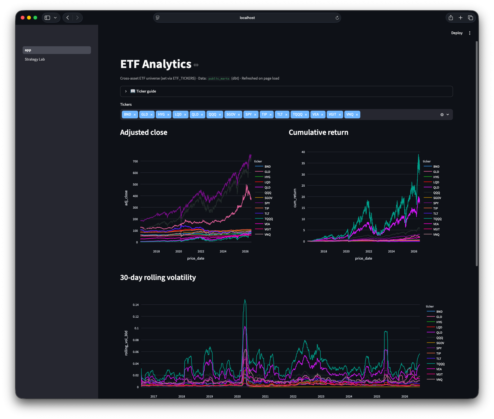
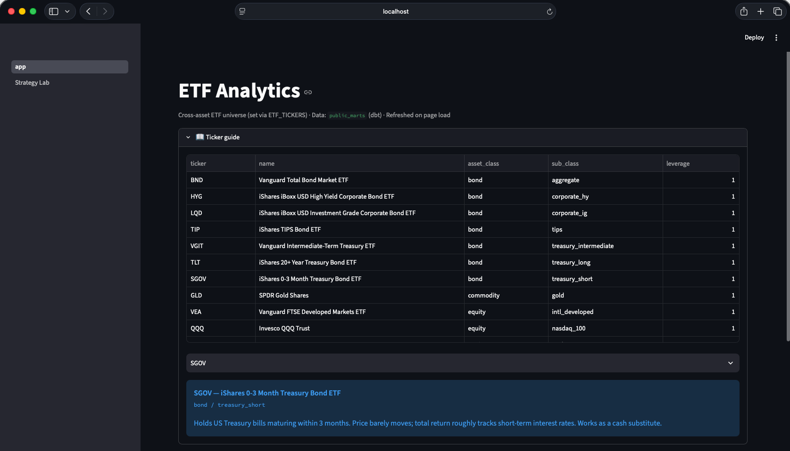
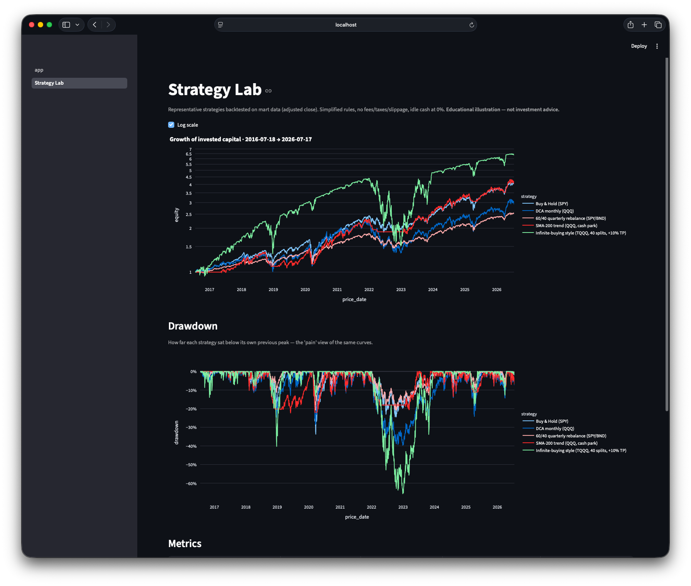
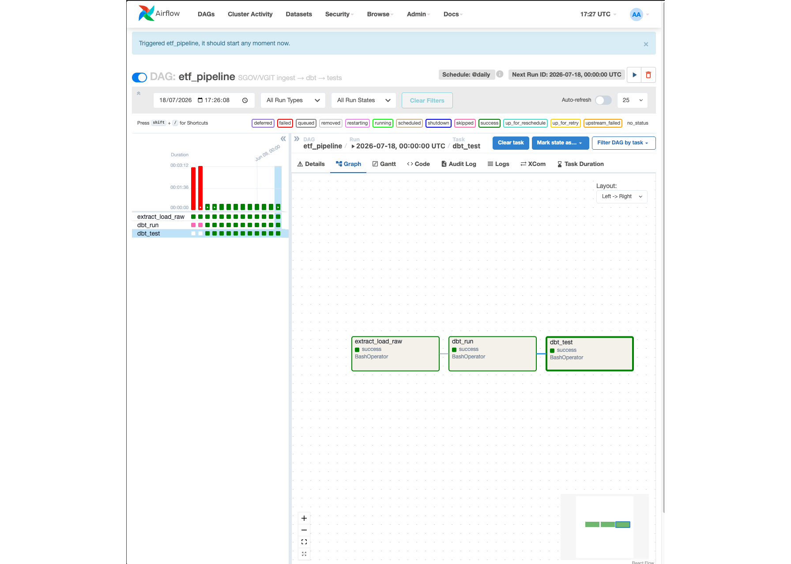
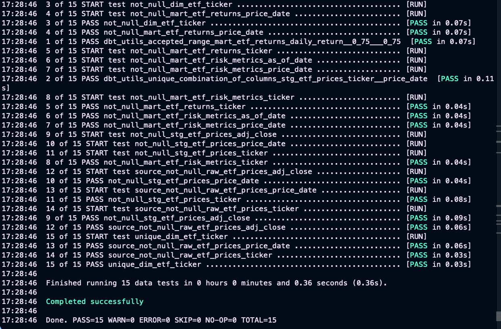

# ETF Analytics Pipeline

🔗 **Live app:** [etf-analytics-pipeline.streamlit.app](https://etf-analytics-pipeline.streamlit.app/) — daily-refreshed Streamlit deployment; the dashboard has a parquet fallback, while Ask uses the configured Postgres warehouse and Gemini API

Automated daily ingestion and analytics for a configurable **cross-asset ETF universe** (17 tickers by default: US large/small-cap, dividend, international developed & emerging equity, leveraged equity, Treasuries, credit, TIPS, gold, REITs). Reproducible raw → staging → mart pipeline, a multipage Streamlit app with a pytest-covered **Strategy Lab**, and a safety-gated **LLM-powered natural-language Q&A layer**. Formal golden-set evaluation is the remaining Q&A roadmap item.

## Business requirement

> Research and portfolio teams need a consistent daily view of ETF performance and risk (returns, volatility, drawdown) across asset classes without copying prices into Excel — and want to ask questions about the data in plain language.

## Features

- **Ingest** — yfinance daily prices (10-year window, one batched request for the whole universe), parquet landing zone + idempotent Postgres upsert; universe is env-driven (`ETF_TICKERS`)
- **Transform** — dbt `staging → marts` (daily returns, 30-day rolling volatility, drawdown) plus a `dim_etf` reference dimension (asset class, sub class, leverage, plain-language description) built from a seed
- **Data quality** — 17 dbt tests including an anomaly tripwire that warns if any daily return exceeds ±75%
- **Orchestration** — Airflow DAG (`ingest → dbt run → dbt test`) and a GitHub Actions daily ingest that commits parquet snapshots
- **Dashboard** — Streamlit multipage: price/return/volatility charts with a stable 24-color palette, an interactive ticker guide, and metric tooltips backed by a shared glossary
- **Strategy Lab** — five classic strategies (buy & hold, monthly DCA, 60/40 rebalance, SMA-200 trend, simplified "infinite buying" cycle on a leveraged ETF) backtested by pure, pytest-covered functions: equity curves, drawdown view, CAGR/vol/MDD/Sharpe
- **Ask** — bilingual lookups, comparisons, rankings, and cross-ETF relationship analysis over the marts; deterministic charts and conclusion-first correlation summaries require no second LLM call
- **Security** — dedicated read-only role (`etf_reader`, SELECT on marts only) for the Q&A layer
- **Demo mode** — with no database reachable, the dashboard pages fall back to the parquet snapshots committed by CI and recompute the marts in pandas; Ask stays disabled until Postgres and Gemini are configured

## LLM Q&A layer

Plain-language questions ("Which long-duration Treasury ETF had the lowest volatility this year?") answered against the marts:

1. **Scope routing + Text-to-SQL** ✅ — normally one Gemini structured-output call returns `data_query` + SQL or a precise `out_of_scope` refusal. The schema prompt is generated from dbt docs (`schema.yml` + `dim_etf`); explicit historical windows up to 10 years override the 1-year default, and cross-ETF relationships work without naming a ticker — see [`qa/ask.py`](qa/ask.py)
2. **Safety** ✅ — generated SQL is parsed with sqlglot and rejected unless it is a single SELECT on whitelisted tables with columns that resolve against the documented mart schema, then executed as `etf_reader` with a row limit and timeout. A documented-column mismatch gets one bounded correction call and the corrected SQL must pass the full guard again. Predictions, investment advice, causal claims and backtests are refused — see the quota-aware runner [`qa/run_week2.py`](qa/run_week2.py)
3. **Charts** ✅ — result shape and question type deterministically select line (time series), bar (ranking/comparison), scatter (relationship), or table; pydantic validation and whitelisted plotting functions keep rendering fail-safe (`qa/ask.py --chart`)
4. **Provider resilience** ✅ — stable model IDs (`gemini-3.1-flash-lite` → `gemini-3.5-flash`), a 20-second request timeout, bounded 429/5xx retries, jitter, and model failover prevent an endless Ask spinner

Design principle: **the LLM emits structured JSON; generated SQL is parsed and validated before read-only execution, generated Python/plotting code is never executed, and chart selection requires no extra model call.**

For generic cross-ETF relationships, Ask defaults to unleveraged funds so 2x/3x
products do not dominate the result. Say “include leveraged ETFs” to override it.
Generic liquidity/volume relationships use log-scaled average daily dollar
volume, and performance windows of two years or longer use CAGR.

The pytest suite covers ingest normalization, strategy math, dashboard demo marts,
Ask orchestration, SQL safety, retry/failover, and chart selection/rendering.
Testing layers, CI boundaries, and local commands are documented in [`docs/testing.md`](docs/testing.md).

## Repository layout

```text
etf-analytics/
├── docs/                   # architecture.md · data-dictionary.md · images/
├── docker-compose.yml      # Postgres + Airflow
├── ingest/                 # fetch_prices.py (env-driven universe) · transform.py
├── data/raw/               # Parquet landing zone (partitioned by ticker/date)
├── dbt/                    # staging & mart models · seeds/etf_info.csv · tests
├── airflow/dags/           # etf_pipeline DAG
├── analytics/              # Pure strategy backtest functions (Strategy Lab)
├── dashboard/              # Streamlit app · shared data/color helpers · Strategy Lab · Ask
├── qa/                     # Structured scope/SQL, safety guard, presentation and eval runner
└── tests/                  # pytest: ingest · analytics · dashboard · Ask · SQL guard
```

## Quick start

### 1. Start infrastructure

```bash
cp .env.example .env        # add GEMINI_API_KEY if using the qa/ layer
docker compose up -d
```

Wait until Airflow UI is available at http://localhost:8080 (default credentials in `.env.example`).

### 2. Install dependencies (one venv at repo root)

```bash
python -m venv .venv          # skip if .venv already exists
source .venv/bin/activate
pip install -r ingest/requirements.txt -r dashboard/requirements.txt -r requirements-dev.txt
```

### 3. Run ingest (verify raw files)

```bash
python ingest/fetch_prices.py
ls -la data/raw/
```

### 4. Run dbt

```bash
cd dbt
cp profiles.yml.example profiles.yml   # edit if needed
dbt debug && dbt seed && dbt run && dbt test
cd ..
```

### 5. Run the project test suite

```bash
pytest tests/ -v
```

### 6. Enable Airflow DAG

After ingest and dbt succeed manually, unpause `etf_pipeline` in the Airflow UI.

### 7. Streamlit app

```bash
streamlit run dashboard/app.py
```

Open http://localhost:8501 — dashboard on the home page, with **Strategy Lab**
and **Ask** in the sidebar. Ask requires a reachable Postgres warehouse and
`GEMINI_API_KEY`; the other pages retain their parquet fallback.

## Screenshots

### Dashboard — cross-asset view



### Ticker guide



### Strategy Lab



### Pipeline





## GitHub Actions

Code validation: [`.github/workflows/test.yml`](.github/workflows/test.yml) — on
every main push and pull request, runs the project pytest suite and a separate
`dbt parse` job. Superseded runs on the same branch are cancelled.

Daily ingest: [`.github/workflows/daily_ingest.yml`](.github/workflows/daily_ingest.yml) — fetches prices on weekdays after US close and commits parquet to `data/raw/`. If pushes fail with a 403, set **Settings → Actions → Workflow permissions → Read and write**.

A manual dispatch can set `dbt_only=true` to rebuild the cloud marts from the
existing raw warehouse without fetching or committing an intraday price snapshot.

### Optional: cloud warehouse (full mode online)

The dashboard works from committed parquet when no database is configured; Ask
is enabled only in full mode. To run Postgres-backed marts online, use a managed
Postgres plan that fits the workload (free-tier limits and pricing may change):

1. Create a free managed Postgres (e.g. [Neon](https://neon.tech) or [Supabase](https://supabase.com)) and apply `scripts/init_db.sql` once (creates `raw.etf_prices` and the read-only `etf_reader` role)
2. Add repo **Actions secrets**: `POSTGRES_HOST`, `POSTGRES_PASSWORD` (and `POSTGRES_PORT` / `POSTGRES_DB` / `POSTGRES_USER` if they differ from the defaults) — the daily workflow then upserts prices **and runs `dbt seed/run/test`** against the cloud warehouse
3. Add the same values to **Streamlit Cloud secrets** — the app detects the warehouse and switches out of demo mode automatically (no code change; that's the fallback design paying off)
4. Add `GEMINI_API_KEY` to Streamlit secrets to enable the **Ask** page online. Set `ASK_PASSWORD` before exposing it publicly so anonymous visitors cannot consume the shared LLM quota

## Data & limitations

- Free market data (yfinance) may be delayed or revised; `adj_close` (split- and distribution-adjusted) is the primary price for all return math
- Strategy Lab uses simplified rules — no fees, taxes, or slippage; idle cash at 0%; signals lagged one day (no look-ahead)
- Not investment advice; for portfolio demonstration and education only

## License

MIT
