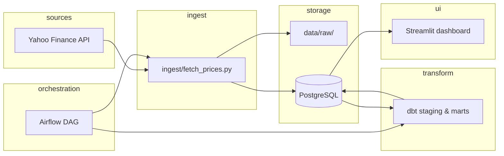
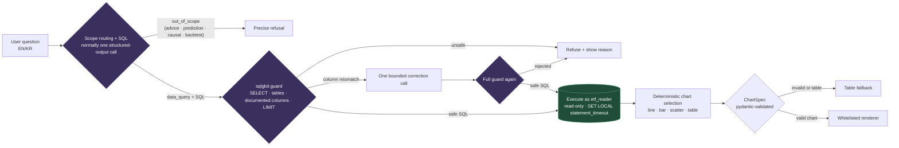

# Architecture

## Overview

Batch pipeline that ingests ETF prices, lands raw files, loads PostgreSQL, transforms with dbt, and serves metrics to a Streamlit dashboard. Orchestration is handled by Airflow once each step runs successfully on its own.

## Components

| Component | Role | Technology |
|-----------|------|------------|
| Ingest | Pull prices from API; write raw | Python, `yfinance` |
| Raw zone | Immutable daily snapshots | `data/raw/` (local; S3 in production) |
| Warehouse | Structured tables for SQL transforms | PostgreSQL 15 |
| Transform | Clean, model, test | dbt |
| Orchestration | Schedule & dependency management | Apache Airflow 2.x |
| Presentation | Charts & comparison tables | Streamlit |

## Data flow

## Layer model

| Layer | Location | Mutability | Purpose |
|-------|----------|------------|---------|
| **raw** | `data/raw/{ticker}/` | Append-only | Preserve source-shaped extracts |
| **staging** | `dbt/models/staging/` | Rebuilt on run | Types, rename, dedupe, calendar align |
| **marts** | `dbt/models/marts/` | Rebuilt on run | Analytics-ready returns & risk metrics |
| **serve** | Streamlit reads marts | Read-only | Human-facing views |

## LLM Q&A layer — security path

Natural-language questions never reach the database as free text. Every request
passes through a fixed chain where **the LLM only emits structured JSON**. The
application validates generated SQL before executing it through a read-only
role; generated Python or plotting code is never executed.

Relationship results carry an explicit `universe_scope` contract. Generic
cross-ETF relationships default to `leverage = 1`; leverage is included when it
is the requested metric or the user explicitly asks for it. Plain volume means
log-scaled average daily dollar volume, explicit historical windows override the
1-year default, and performance windows of 2 years or longer use CAGR.

Defence in depth: even if the gate and the sqlglot allowlist were both bypassed,
execution runs as `etf_reader` (SELECT-only on `public_marts`), so writes and
non-whitelisted tables are impossible at the database level. Generated SQL is
surfaced in the UI for transparency and auditability.

## Airflow DAG

DAG id: `etf_pipeline` (see `airflow/dags/etf_pipeline_dag.py`)

| Task | Command / operator | Depends on |
|------|-------------------|------------|
| `extract_load_raw` | Bash: `python ingest/fetch_prices.py` | — |
| `dbt_run` | Bash: `dbt deps && dbt run --profiles-dir .` (in `dbt/`) | `extract_load_raw` |
| `dbt_test` | Bash: `dbt test --profiles-dir .` (in `dbt/`) | `dbt_run` |

> **Rule:** Add tasks to the DAG only after each command succeeds manually from the CLI.

## Environments

| Environment | Raw storage | Warehouse | Orchestration |
|-------------|-------------|-----------|---------------|
| Local (this repo) | `data/raw/` | Docker Postgres | Docker Airflow |
| Cloud full mode (live) | Managed Postgres `raw.etf_prices` | Managed Postgres marts | GitHub Actions (`daily_ingest.yml`) |
| Dashboard fallback | Bundled `data/raw/` snapshot | pandas mart mirror | Streamlit only; intentionally not scheduled |
| Production-style | S3 `s3://bucket/raw/etf/` | RDS Postgres | Managed Airflow / MWAA |

## Security & config

- Secrets via `.env` (never commit `.env`)
- See `.env.example` for variable names

## Observability (future)

- Airflow task logs
- dbt run artifacts under `dbt/target/`
- Optional: data freshness check on `mart_etf_risk_metrics.as_of_date`
