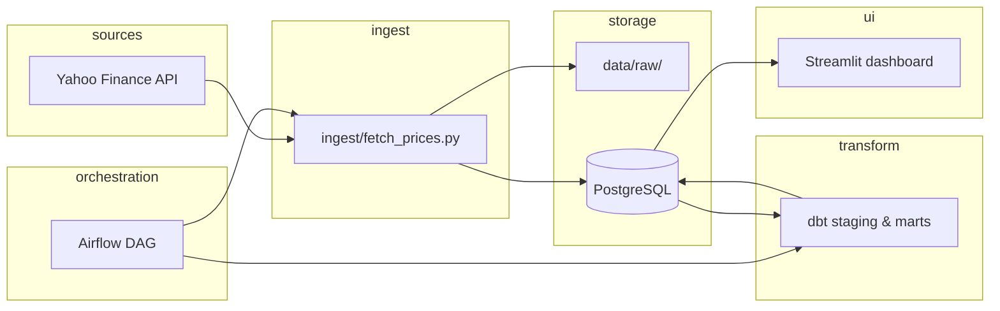

# Architecture

New to ETFs or data systems? Read the plain-language **Start here if you are not
technical** section in the main README before this implementation reference.

## Overview

Batch pipeline that ingests ETF prices, lands raw files, loads PostgreSQL, transforms with dbt, and serves metrics to a Streamlit dashboard. Orchestration is handled by Airflow once each step runs successfully on its own.

## Components

| Component | Role | Technology |
|-----------|------|------------|
| Ingest | Pull prices from API; write raw | Python, `yfinance` |
| Raw zone | Source-shaped snapshots before loading | `data/raw/` locally; temporary runner storage in the hosted job |
| Warehouse | Structured tables for SQL transforms | PostgreSQL 15 |
| Transform | Clean, model, test | dbt |
| Orchestration | Schedule & dependency management | Airflow locally; GitHub Actions for the hosted refresh |
| Presentation | Charts & comparison tables | Streamlit |
| Natural-language Q&A | Read-only Korean/English questions over marts | Gemini, sqlglot, `etf_reader` |

The presentation layer has one shared `dashboard/i18n.py` contract. English is
the default for international portfolio review; the sidebar language control
keeps English/Korean selection across pages during the Streamlit session. Ask
answers and generated chart labels follow the question language independently
of the surrounding interface. `dashboard/app.py` uses `st.navigation`, while
the home and two feature pages remain separate modules; this keeps shared
session state intact without merging the page implementations.

## Data flow

## Layer model

| Layer | Location | Mutability | Purpose |
|-------|----------|------------|---------|
| **raw** | `data/raw/{ticker}/` | Append-only | Preserve source-shaped extracts |
| **staging** | `dbt/models/staging/` | Rebuilt on run | Types, rename, dedupe, calendar align |
| **marts** | `dbt/models/marts/` | Rebuilt on run | Analytics-ready returns & risk metrics |
| **serve** | Streamlit reads marts | Read-only | Human-facing views |

### History and refresh policy

- **Retention:** keep every loaded trading day in `raw.etf_prices`; there is no age-based delete. The row count is small for a 17-ETF daily universe, and older regimes are more valuable than the storage saved by truncating them.
- **Initial/manual backfill:** request `max`, preserving the vendor history available after each ETF's actual inception.
- **Weekday refresh:** request a trailing 1-month overlap and upsert it. The overlap catches delayed sessions and recent corrections without rewriting all history every day.
- **Monthly reconciliation:** request `max` again so retroactive adjusted-close changes from distributions or splits propagate through the full retained series instead of stopping at an arbitrary boundary.
- **Analysis contract:** dashboards use actual common observations. Ask accepts explicit trailing windows up to 20 years and returns start/end dates plus observation counts; it never synthesizes pre-inception history.
- dbt rebuilds the analysis marts from all retained raw rows. The bundled parquet fallback is a deliberately fixed snapshot and can have a shorter range than the live warehouse.

## LLM Q&A layer — security path

Natural-language questions never reach the database as free text. Every request
passes through a fixed chain where **the LLM only emits structured JSON**. The
application validates generated SQL before executing it through a read-only
role; generated Python or plotting code is never executed.

Relationship results carry an explicit `universe_scope` contract. Generic
cross-ETF relationships default to `leverage = 1`; leverage is included when it
is the requested metric or the user explicitly asks for it. Plain volume means
a log-scaled adjusted-price dollar-volume proxy, explicit historical windows up
to 20 years override the 1-year default when actual coverage is complete, and
performance windows of 2 years or longer use CAGR.

Defence in depth: `etf_reader` has SELECT only on `public_marts`, defaults to
read-only transactions, and the application also issues `SET TRANSACTION READ
ONLY` before the query. A fixed `pg_catalog`-only search path avoids resolving
objects from application or user schemas; mart tables must be fully qualified.
The parser still rejects
tableless SELECTs and any function outside its reviewed allowlist because
PostgreSQL SELECT expressions can have side effects. Generated SQL is surfaced
in the UI for transparency and auditability.

## Airflow DAG

DAG id: `etf_pipeline` (see `airflow/dags/etf_pipeline_dag.py`)

The daily DAG explicitly passes `FETCH_PERIOD=1mo`. This matters because the
standalone ingest command defaults to `max` for a canonical backfill.

| Task | Command / operator | Depends on |
|------|-------------------|------------|
| `extract_load_raw` | Bash: `python ingest/fetch_prices.py` | — |
| `dbt_run` | Bash: `dbt deps && dbt run --profiles-dir .` (in `dbt/`) | `extract_load_raw` |
| `dbt_test` | Bash: `dbt test --profiles-dir .` (in `dbt/`) | `dbt_run` |

> **Rule:** Add tasks to the DAG only after each command succeeds manually from the CLI.

## Environments

| Environment | Raw storage | Warehouse | Orchestration |
|-------------|-------------|-----------|---------------|
| Local (this repo) | `data/raw/` | Docker Postgres | Docker Airflow |
| Cloud full mode (live) | Managed Postgres `raw.etf_prices` | Managed Postgres marts | GitHub Actions (`daily_ingest.yml`) |
| Dashboard fallback | Bundled `data/raw/` snapshot | pandas mart mirror | Streamlit only; intentionally not scheduled |
| Production-style | S3 `s3://bucket/raw/etf/` | RDS Postgres | Managed Airflow / MWAA |

## Security & config

- Secrets via `.env` (never commit `.env`)
- See `.env.example` for variable names

## Observability

- Airflow task logs
- GitHub Actions run logs for code checks and hosted data refreshes
- dbt run artifacts under `dbt/target/`
- A failing dbt test when any configured ticker's newest `as_of_date` is more than seven days old
- Ask request/error events under `qa/logs/` locally (questions can be sensitive; do not publish raw logs)
